# chock-copilot-plugins

[](https://github.com/open-coder-ai/chock-copilot-plugins/actions/workflows/generated-only.yml)
[](LICENSE)
[](https://github.com/open-coder-ai/chock-catalog)

Chock policies packaged as installable plugins for **GitHub Copilot** — Copilot CLI and
VS Code agent mode. Guard policies ship a real `PreToolUse` hook, so a matched destructive
command is **denied in the session**, not just discouraged.



**This repository is generated.** Every file is compiled from policy sources in
[chock-catalog](https://github.com/open-coder-ai/chock-catalog) by
[chock](https://github.com/open-coder-ai/chock). Pull requests here are closed with a
pointer to the catalog — review belongs where the source is.

## Which clients this works with

These packages use the **Claude plugin format**, which VS Code and GitHub Copilot CLI read
natively (VS Code auto-detects the format and sets `CLAUDE_PLUGIN_ROOT` for the hook). The
same packages also work in Claude Code. This repository is the
**Copilot-branded** distribution of that content; the format-named distribution lives at
[chock-claude-plugins](https://github.com/open-coder-ai/chock-claude-plugins) and the two
are byte-identical where they overlap, because both are generated from the same catalog.
Cursor and Codex users are served by
[chock-cursor-plugins](https://github.com/open-coder-ai/chock-cursor-plugins) and
[chock-codex-plugins](https://github.com/open-coder-ai/chock-codex-plugins), which carry
those vendors' own formats and deny dialects.

```
# VS Code / GitHub Copilot: add this repository as a plugin marketplace, then install a
# plugin by name. See the Copilot plugins marketplace and VS Code's agent-plugins docs:
#   https://github.com/github/copilot-plugins
#   https://code.visualstudio.com/docs/agent-customization/agent-plugins
```

Clients that read the Agent Plugins 1.0 standard instead can use the `agent-plugins/` tree
(advisory: the standard carries skills, not hooks).

## What a plugin actually does — read this before installing

Chock's rule is that a claim must match a mechanism, and that rule applies to these
packages: they are not equally strong and they say so in each description.

- **Guard policies** (e.g. `block-destructive-commands`) ship a `PreToolUse` hook and are
  **session-enforced** where the host honours it — the hook exits non-zero and the client
  refuses the call. This needs `python3` and a usable shell on PATH. Without them,
  fail-open clients allow silently and fail-closed clients refuse matched commands; on
  Windows, disable the `python3` Microsoft Store alias or install Python. Every guard's
  description states this posture verbatim.
- **Advisory policies** are a skill the client reads. They shape behaviour; they cannot
  block anything on their own.

See **[PLUGINS.md](PLUGINS.md)** for the full list: every policy, its version, whether it
enforces or advises in this client, and a link to its page in the catalog. That file is
generated from the packages themselves, so it cannot drift from what is published.

**A plugin is not the same as adopting Chock.** A plugin governs one person's session on
one client. It cannot enforce anything at commit time, it does not travel with a clone, and
it does not run in CI. Repository-wide enforcement — git hooks and a CI gate that a
`--no-verify` cannot skip — comes from installing Chock in the repo:

```bash
pip install chock
chock init && chock sync --ci
```

## Layout

```
claude/<policy-id>/          Claude-layout packages (hooks where the policy has a guard) — Copilot reads these natively
copilot/<policy-id>/         Agent Plugins 1.0 layout with the same hook under com.github.copilot/ — for spec-validating marketplaces
agent-plugins/<policy-id>/   plain Agent Plugins 1.0 packages (advisory: the standard itself has no hooks)
.claude-plugin/marketplace.json    the index VS Code and Claude Code read
.github/plugin/marketplace.json    byte-identical copy, the path Copilot CLI reads
```

The trees are deliberately separate. The same policy is enforced in a package that ships a
hook and advisory in a package that cannot carry one — so a shared skill file would have to
make a claim that is false for one of them. `claude/` and `copilot/` run byte-identical
hooks; they differ only in where the manifest and hook file live, because marketplace
validators disagree about that.

## Trust

- **Generated only:** CI regenerates from the pinned catalog and fails on any difference,
  so content here cannot be hand-edited into something the catalog never published.
- **Byte-identical guards:** guard scripts and the hook adapter are verbatim copies of
  their sources in the framework — a plugin cannot quietly behave differently from a
  repository install.
- **Best-effort, not a boundary:** guards are pattern-based filters. Aliases, quoting, and
  unusual paths can evade them. See
  [SECURITY.md](https://github.com/open-coder-ai/chock/blob/main/SECURITY.md) and the
  [assurance case](https://github.com/open-coder-ai/chock/blob/main/docs/assurance-case.md).
- **Tested upstream, and gated:** every policy ships an eval suite
  (`base/<policy>/evals/suite.yaml`) in the catalog, and the publish workflow runs
  `chock check` and `chock check --only evals` before packaging anything — a policy whose
  evals fail cannot reach this repository. The tests live in the catalog because the policy
  source does; this repository is compiled output.
- **This README is the exception:** it is the one file the publisher never writes, so it
  alone sits outside the generated-only guarantee. Everything else here regenerates.

### Verify it yourself

Nothing above asks for trust that cannot be checked. This rebuilds the published tree from
source and compares it with what is committed here:

```bash
git clone https://github.com/open-coder-ai/chock-copilot-plugins dist
git clone --branch v0.7.0 https://github.com/open-coder-ai/chock framework
git clone https://github.com/open-coder-ai/chock-catalog catalog
pip install ./framework
chock plugin build --repo catalog --policies-dir base --format agent-plugins --out-dir dist
chock plugin build --repo catalog --policies-dir base --format claude --out-dir dist
chock plugin build --repo catalog --policies-dir base --format copilot --out-dir dist
chock marketplace build --dist dist
git -C dist diff --exit-code && git -C dist status --porcelain
```

Silence from both `git` commands means this repository is byte-identical to a fresh build
from the catalog. `--branch v0.7.0` is the framework release this tree was published from.
`chock-market.lock` records a sha256 per published plugin directory, so one package can be
checked without rebuilding the rest.

**If you are listing these plugins in a marketplace,** pin both a tag and the full commit
SHA. The tag names the release; the SHA is what holds the reviewed bytes still.


## License

Apache-2.0, same as the framework and the catalog.
